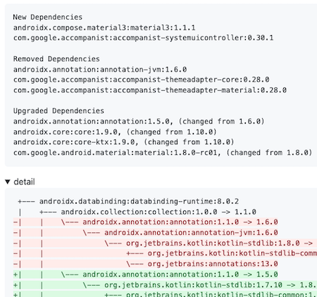

[](https://github.com/yumemi-inc/gradle-dependency-diff-report/actions/workflows/ci.yml)

# Gradle Dependency Diff Report

A GitHub Action that reports Gradle dependency differences.
The report is displayed in job summaries.

|  | 
|:--:| 
| [report sample](https://github.com/yumemi-inc/gradle-dependency-diff-report/actions/runs/7295539669) |

Reports are created with Gradle `dependencies` task, [dependency-diff-tldr](https://github.com/careem/dependency-diff-tldr), and [Dependency Tree Diff](https://github.com/JakeWharton/dependency-tree-diff).

## Usage

See [action.yml](action.yml) for available action inputs and outputs.
Note that this action requires `contents: read` permission.

### Supported workflow trigger events

Works on any event.
Basically it works as is, but if you want to customize it, refer to the [Specify comparison targets](#specify-comparison-targets) section.

### Basic

At a minimum, just prepare a workflow as follows:

```yaml
name: Dependency Diff Report

on: pull_request

jobs:
  report:
    runs-on: ubuntu-latest
    permissions:
      contents: read
    steps:
      - uses: yumemi-inc/gradle-dependency-diff-report@v2
        with:
          modules: 'app'
          configuration: 'releaseRuntimeClasspath'
```

### Specify multiple modules

If you specify only the root module of the application, the modules that root depends on will also be reported.
But if there is no root module or if you need to report on individual modules, specify them separated by spaces or line breaks.

```yaml
- uses: yumemi-inc/gradle-dependency-diff-report@v2
  with:
    modules: |
     app
     feature:main feature:login
     domain
    configuration: 'releaseRuntimeClasspath'
```

At this time, if you want to apply a different configuration, specify it separated by `|`.

```yaml
- uses: yumemi-inc/gradle-dependency-diff-report@v2
  with:
    modules: |
      app|productionReleaseRuntimeClasspath
      feature:main feature:login
      domain|debugRuntimeClasspath
    configuration: 'releaseRuntimeClasspath'
```

### Specify Java version

If not specified, the default version of the runner will be applied.
For `ubuntu-22.04` it is `11`.
If you want to use a different version, specify it using [actions/setup-java](https://github.com/actions/setup-java).

```yaml
- uses: actions/setup-java@v3
  with:
    distribution: 'zulu'
    java-version: 17
- uses: yumemi-inc/gradle-dependency-diff-report@v2
  with:
    modules: 'app'
    configuration: 'releaseRuntimeClasspath'
```

### Specify application root directory

If the repository root directory and application root directory do not match, specify it with `project-dir` input.

```yaml
- uses: yumemi-inc/gradle-dependency-diff-report@v2
  with:
    modules: 'app'
    configuration: 'releaseRuntimeClasspath'
    project-dir: 'myApp'
```

### Specify comparison targets

Gradle application project code between `head-ref` input and `base-ref` input references is compared.
The behavior is the same as [yumemi-inc/path-filter](https://github.com/yumemi-inc/path-filter#specify-comparison-targets), so refer to it for details.

## Tips

### Report only when library changes

To prevent unnecessary workflow runs, you can use [GitHub's path filter](https://docs.github.com/en/actions/using-workflows/workflow-syntax-for-github-actions#onpushpull_requestpull_request_targetpathspaths-ignore).
Specify file paths containing library versions to `paths:`.

```yaml
on:
  pull_request:
    paths:
      - '**/*.gradle*'
      - '**/libs.versions.toml'
```

If you want to control at step or job level, you can use [yumemi-inc/path-filter](https://github.com/yumemi-inc/path-filter#specify-comparison-targets) (or [yumemi-inc/changed-files](https://github.com/yumemi-inc/changed-files)).

```yaml
- uses: yumemi-inc/path-filter@v2
  id: filter
  with:
    patterns: |
      **/*.gradle*
      **/libs.versions.toml
- if: steps.filter.outputs.exists == 'true' # or fromJSON(steps.filter.outputs.exists)
  uses: yumemi-inc/gradle-dependency-diff-report@v2
  with:
    modules: 'app'
    configuration: 'releaseRuntimeClasspath'
```

### Use this action's output

This is an example of using `exists-diff` output to notify a pull request with a comment if there are any differences in dependencies.

```yaml
- uses: yumemi-inc/gradle-dependency-diff-report@v2
  id: report
  with:
    modules: 'app'
    configuration: 'releaseRuntimeClasspath'
- if: steps.report.outputs.exists-diff == 'true' # or fromJSON(steps.report.outputs.exists-diff)
  uses: yumemi-inc/comment-pull-request@v1
  with:
    comment: |
      :warning: There are differences in dependencies. See details [here](https://github.com/${{ github.repository }}/actions/runs/${{ github.run_id }}).
```

Note that [yumemi-inc/comment-pull-request](https://github.com/yumemi-inc/comment-pull-request) requires `pull-requests: write` permission.

### Use Gradle cache

This action uses Gradle `dependencies` task, so you can expect faster processing by using Gradle cache.

```yaml
- uses: gradle/gradle-build-action@v2
- uses: yumemi-inc/gradle-dependency-diff-report@v2
  with:
    modules: 'app'
    configuration: 'releaseRuntimeClasspath'
```

> [!NOTE]  
> Since [gradle/gradle-build-action](https://github.com/gradle/gradle-build-action#using-the-cache-read-only) does not generate a cache in the HEAD branch of a pull request, in order to use the cache in a pull request, you must first generate a cache in the default branch with another workflow or something.

### Process multiple modules in parallel

By processing multiple modules in parallel with multiple jobs, waiting time can be expected to be reduced.

<details>
<summary>example</summary>

```yaml
jobs:
  report-group-a:
    runs-on: ubuntu-latest
    permissions:
      contents: read
    outputs:
      exists-diff: ${{ steps.report.outputs.exists-diff }}
    steps:
      - uses: yumemi-inc/gradle-dependency-diff-report@v2
        id: report
        with:
          modules: 'app domain'
          configuration: 'releaseRuntimeClasspath'
  report-group-b:
    runs-on: ubuntu-latest
    permissions:
      contents: read
    outputs:
      exists-diff: ${{ steps.report.outputs.exists-diff }}
    steps:
      - uses: yumemi-inc/gradle-dependency-diff-report@v2
        id: report
        with:
          modules: 'feature:main feature:login'
          configuration: 'releaseRuntimeClasspath'
  comment-on-pull-request:
    if: contains(needs.*.outputs.exists-diff, 'true')
    needs: [report-group-a, report-group-b]
    runs-on: ubuntu-latest
    permissions:
      pull-requests: write
    steps:
      - uses: yumemi-inc/comment-pull-request@v1
      ...
```
</details>

### Pass environment variables

If you want to pass some environment variables for `dependencies` task, specify them with `env:`.

```yaml
- uses: yumemi-inc/gradle-dependency-diff-report@v2
  env:
    YOUR_ENV_1: ...
    YOUR_ENV_2: ...
  with:
    modules: 'app'
    configuration: 'releaseRuntimeClasspath'
```

### Run bash script

If you want to do some processing before `dependencies` task, specify it with `script` input.

```yaml
- uses: yumemi-inc/gradle-dependency-diff-report@v2
  with:
    modules: 'app'
    configuration: 'releaseRuntimeClasspath'
    script: |
      cp .github/ci-gradle.properties ~/.gradle/gradle.properties
      ...
```

At this time, environment variables and `${{ }}` expressions can be used.

```yaml
- uses: yumemi-inc/gradle-dependency-diff-report@v2
  with:
    modules: 'app'
    configuration: 'releaseRuntimeClasspath'
    script: |
      echo $GITHUB_REF
      echo ${{ github.actor }}
```

## Examples

<details>
<summary>The entire workflow I often create</summary>

```yaml
name: Dependency Diff Report

on:
  pull_request:
    paths:
      - '**/*.gradle*'
      - '**/libs.versions.toml'

concurrency:
  group: ${{ github.workflow }}-${{ github.head_ref || github.run_id }}
  cancel-in-progress: true

jobs:
  report:
    name: Report dependency differences
    runs-on: ubuntu-latest
    permissions:
      contents: read
      pull-requests: write
    env:
      LOG_URL: https://github.com/${{ github.repository }}/actions/runs/${{ github.run_id }}
    steps:
      - name: Set up JDK
        uses: actions/setup-java@v3
        with:
          distribution: 'zulu'
          java-version: '17'
      - name: Report
        uses: yumemi-inc/gradle-dependency-diff-report@v2
        id: report
        with:
          modules: 'app'
          configuration: 'productionReleaseRuntimeClasspath'
      - name: Comment
        if: steps.report.outputs.exists-diff == 'true' || failure()
        uses: yumemi-inc/comment-pull-request@v1
        with:
          comment: ':warning: There are differences in dependencies. See details [here](${{ env.LOG_URL }}).'
          comment-if-failure: ':exclamation: Report workflow failed. See details [here](${{ env.LOG_URL }}).'
```
</details>
